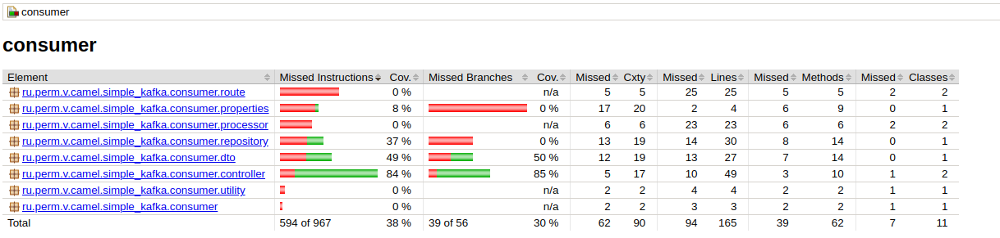

В проекте читаются сообщения из очереди Kafka "camel-integration". 

Название очереди задано в application.yaml

````yaml
  ru.perm.v.camelkafka:
    topic-name: camel-integration
````

В проект подтягивается через [ru.perm.v.camel.simple_kafka.consumer.properties.KafkaConfigurationProperties.java](https://github.com/cherepakhin/camel_boot_kafka_read/blob/main/consumer/src/main/java/ru/perm/v/camel/simple_kafka/consumer/properties/KafkaConfigurationProperties.java).

Это собственный параметр в yaml файле (не spring и не другого фраймворка, а __частный__ параметр проекта [https://v.perm.ru/index.php/kotlin/simple-kotlin#add_param_to_application_yaml]{https://v.perm.ru/index.php/kotlin/simple-kotlin#add_param_to_application_yaml}).

Использовано в [ru.perm.v.camel.simple_kafka.consumer.route.ConsumerKafkaQueueCamelIntegrationRoute]{https://github.com/cherepakhin/camel_boot_kafka_read/blob/main/consumer/src/main/java/ru/perm/v/camel/simple_kafka/consumer/route/ConsumerKafkaQueueCamelIntegrationRoute.java}

````shell
@EnableConfigurationProperties(value = KafkaConfigurationProperties.class)
public class ConsumerKafkaQueueCamelIntegrationRoute extends RouteBuilder {

    private KafkaConfigurationProperties kafkaConfigurationProperties;
....
    public ConsumerKafkaQueueCamelIntegrationRoute(
            KafkaConfigurationProperties kafkaConfigurationProperties,
            ....
        this.kafkaConfigurationProperties = kafkaConfigurationProperties;
        ...
    }
    
    @Override
    public void configure() throws Exception {
        log.info("kafkaConfigurationProperties.topicName {}", kafkaConfigurationProperties.topicName);
        ....
    }                    
....
````

__Запуск проекта:__

````shell
export BOOTSTRAP_SERVERS=http://192.168.1.20:9092
./mvnw spring-boot:run
````
(consumer/run.sh)

__Проверка через echo контроллер__:

````shell
http http://127.0.0.1:9090/api/fortest/echo/aaa

aaa
````

__Показать последнее принятое сообщение:__

````shell
http :9090/api/messages/ 
````
(внимание на последний "/")


Сообщения можно отправлять вручную (описано ниже) или генерировать другой программой 
(см. vasi@vasi-note:~/prog/java/camel/camel-integration-spring-boot-kafka/producer)

__Отправка сообщений вручную.__

Можно использовать какой-нибудь UI инструмент [UI для Kafka](https://v.perm.ru/index.php/instrumenty-devops/ui-dla-kafka) или через консоль.

````shell
cd ~/prog/java/camel/camel-integration-spring-boot-kafka
jq -rc . producer/doc/example_message1.json | /home/vasi/tools/kafka/bin/kafka-console-producer.sh --broker-list 192.168.1.20:9092 --topic camel-integration
````

Для демонстрации отправить сообщения по одному в Kafka топик "camel-integration" (ниже использована утилита  [jq](https://www.baeldung.com/linux/jq-command-json)). ИСПОЛЬЗОВАТЬ НУЖНО ИМЕННО JQ (убирает переводы строк), т.к. "cat" не так сработает (не убирает переводы строк).

Примеры сообщений:

````shell
cat example_message1.json
{"id": "26929514-237C-11ED-861D-0242AC120001", "name": "NAME1", "description": "DESCRIPTION1"}
````

[Примеры использования](#jq_example) в конце Readme.md.

__Отправка в топик средствами Kafka:__

````shell
jq -rc . example1.json | ./kafka/bin/kafka-console-producer.sh --broker-list 192.168.1.20:9092 --topic camel-integration
````

Другие тестовые сообщения:

````json
{
    "id": "f10e37fa-0da7-4854-a292-33948f2ce331",
    "name": "Name1",
    "description": "Description1",
},
{
    "id": "f10e37fa-0da7-4854-a292-33948f2ce332",
    "name": "Name2",
    "description": "Description2",
}
````

Сообщения логируются:

````text
2024-11-18 13:30:38.164  INFO 17625 --- [camel-integration] c.b.r.processor.MessageBodyLogger        : Polled camel-integration: MessageDTO(id=f10e37fa-0da7-4854-a292-33948f2ce331, name=Name2, descriptor=Description2)
````

Класс __ru.perm.v.camel.simple_kafka.consumer.MessageInformationConsumptionRoute.java__ читает из топика __camel-integration__ и сохраняет в memory database. 

__Прочитать сохраненные сообщения через REST:__ 

````shell
http :9090/api/messages
[
    {
        "id": "f10e37fa-0da7-4854-a292-33948f2ce330",
        "name": "Name1",
        "description": "Description1",
    },
    {
        "id": "f10e37fa-0da7-4854-a292-33948f2ce440",
        "name": "Name2",
        "description": "Description2",
    }
]
````
<a id="jq_example"></a>
Использование __jq__

````shell
$ jq -rc . example1.json
  {"id":"f10e37fa-0da7-4854-a292-33948f2ce330","name":"Name1","descriptor":"Descriptor1","power":"Power1","prefix":"Prefix1","suffix":"Suffix1"}

$ jq -rc .name example1.json
Name1

$ jq -rc .name,.power example1.json
    Name1
    Power1

Цветной вывод:
$ jq -C . example1.json
{
    "id": "f10e37fa-0da7-4854-a292-33948f2ce330",
    "name": "Name1",
    "descriptor": "Descriptor1",
    "power": "Power1",
    "prefix": "Prefix1",
    "suffix": "Suffix1"
}
````

__Разное__

Два варианта конвертации в __stream в list__.

с __foreach__:

```java
// Variant 1 of convert
        List<MessageDTO> messages = new ArrayList<>();
        messageEntityRepository
                .findAll()
                .forEach(messageEntity ->
                        messages.add(
                                new MessageDTO(
                                        messageEntity.getId(),
                                        messageEntity.getName(),
                                        messageEntity.getDescription())));
        return messages;
````
с __map__:
```java
// Variant 2 of convert (with stream ... toList())
        Iterable<MessageEntity> iterable = messageEntityRepository.findAll();
        List<MessageEntity> entities = Lists.newArrayList(iterable);

        return entities.stream().map(e ->
                new MessageDTO(e.getId(), e.getName(), e.getDescription())).toList();

```

# Ручное проведение теста

запустить consumer скриптом:

````shell
consumer$ ./run.sh
````

Отправить сообщения скриптом:

````shell
$ producer/doc/send_many_messages.sh 100
````

"100" - количество отправляемых сообщений.

Consumer примет сообщения. Прочитать принятые сообщения командой:

````shell
$ http :9090/api/messages/
````

Удалить все сообщения в базе данных:

````shell
$ http DELETE :9090/api/messages/
````

### Тестирование

Подключен контроль покрытия тестами. Сделано с помощью [jacoco](https://www.jacoco.org/jacoco/). Отчет генерируется автоматически при прогоне тестов или:

````shell
./mvnw jacoco:report
````

Отчет в consumer/target/site/jacoco/index.html

