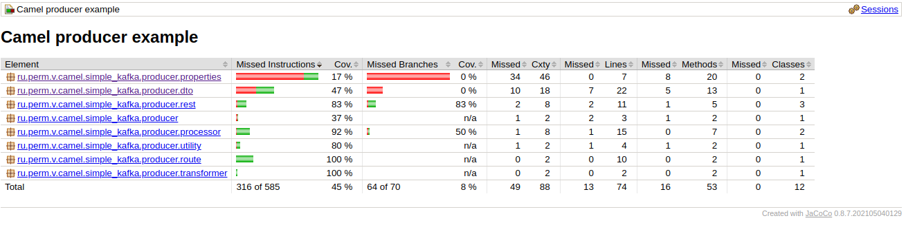

Генерирует сообщения и отправляет сообщения в Kafka в очередь "camel-integration" 
(см. application.properties "ru.perm.v.kafka.topic-name=camel-integration")

сообщения читает другой сервис ~/prog/java/camel/camel-integration-spring-boot-kafka/consumer
Простая проверка, что сервис PRODUCER запущен:

````shell
$ http :8081/api/echo/ANY_MESSAGE
ANY_MESSAGE
````

Для проверки работы с Kafka всего комплекса запустить consumer

````shell
cd consumer
./run.sh
````

Запустить producer:

````shell
cd producer
./run.sh
````

Producer отправляет сообщения в Kafka каждые 5 сек. Consumer их принимает и сохраняет в базу данных. Проверить сохраненные сообщения запросом:

````shell
http http://192.168.1.20:8082/api/messages

[
    {
        "description": "n: 1",
        "id": "478bd6ea-0fdb-4aed-be5b-55c9bb14e7ad",
        "name": "2024-12-08 10:49:51"
    },
    {
        "description": "n: 2",
        "id": "8213b6c8-c768-4be4-8395-ae1e6f97e797",
        "name": "2024-12-08 10:49:56"
    },
    ....
````

Сообщения отправляются каждые 5 сек, время отправки в __name__.

### Создание FAT jar файла

````shell
cd producer
./mvnv -Dmaven.test.skip=true package
````

запуск:

````shell
/usr/lib/jvm/java-17-openjdk-amd64/bin/java -jar target/producer-0.0.1.jar
````

Настроено в [run_producer.sh](../run_producer.sh)

### Тестирование

Подключен контроль покрытия тестами. Сделано с помощью [jacoco](https://www.jacoco.org/jacoco/). Отчет генерируется автоматически при прогоне тестов или:

````shell
./mvnw test
./mvnw jacoco:report
````

Отчет в producer/target/site/jacoco/index.html


Deploy to local Nexus repsitory:

````shell
./mvnw deploy
````
